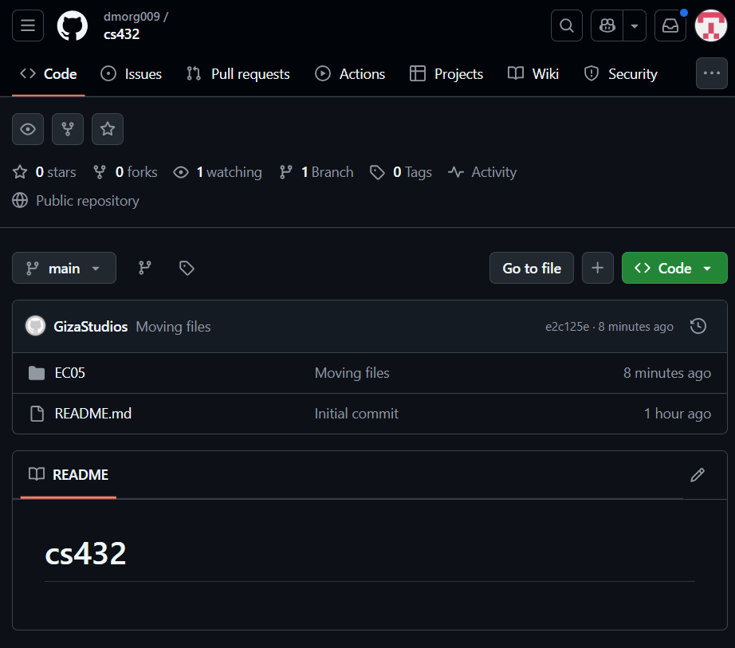

# EC 0.6 - Reports

### Devin Morgan

### CS 432, Spring 2025

### 1/25/2025

Below is a screenshot of my github repo.



```python
#Changing locally
a = "Hello, World! YuhYuhYuh"
print(a[5])
```

The table below shows a simple table.

| Week | Date   | Topic                                            |
| :--- | :----- | :----------------------------------------------- |
| 1    | Jan 11 | Introduction to Web Science and Web Architecture |
| 2    | Jan 18 | Introduction to Python                           |
| 3    | Jan 25 | Measuring the Web                                |
| 4    | Feb 1  | Searching the Web                                |

# References

_Every report must list the references that you consulted while completing the assignment. If you consulted a webpage, you must include the URL. These are just a couple examples._

- Python (programming language) - Wikipedia, <https://en.wikipedia.org/wiki/Python_(programming_language)>
- User Datagram Protocol - Wikipedia, <https://en.wikipedia.org/wiki/User_Datagram_Protocol>
- Web science - Wikipedia, <https://en.wikipedia.org/wiki/Web_science>
