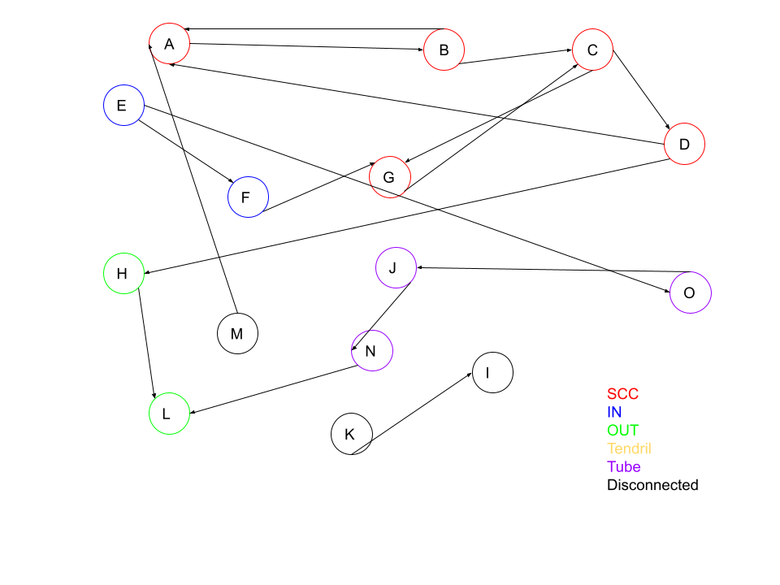

# HW1 - Web Science Intro

### Devin Morgan

### CS 432, Spring 2025

### 02/02/2025

# Q1

Now consider the following links:
'''text
A --> B
B --> A
B --> C
C --> D
C --> G
D --> A
D --> H
E --> F
E --> O
F --> G
G --> C
H --> L
J --> N
K --> I
M --> A
N --> L
O --> J
'''
Draw the resulting directed graph and list the nodes (in alphabetical order) that are each category.

## Answer



- SCC:
  - A
  - B
  - C
  - D
  - G
- IN:
- OUT:
- Tendrils:
- Tubes:
- Disconnected:

```python
#!/usr/local/bin/python3
# testargs.py

import sys

print ("{} is the name of the script." . format(sys.argv[0]))
print ("There are {} arguments: {}" . format(len(sys.argv), str(sys.argv)))

for ind, arg in enumerate(sys.argv):
    print ("[{}]: {} {}".format(ind,arg,sys.argv[ind]))
```

The table below shows a simple table.

| Week | Date       | Topic                                   |
| :--- | :--------- | :-------------------------------------- |
| 1    | Sep 1, 3   | Introduction, What's Vis and Why Do It? |
| 2    | Sep 8, 10  | Data and Data Cleaning                  |
| 3    | Sep 15, 17 | Marks and Channels                      |

The table below shows an example confusion matrix (you'll see this term later) from <https://en.wikipedia.org/wiki/Confusion_matrix>.

|               |     | Actual |        |
| ------------- | --- | ------ | ------ |
| **Predicted** |     | Cat    | Dog    |
|               | Cat | 5 (TP) | 3 (FP) |
|               | Dog | 2 (FN) | 3 (TN) |

_You must provide some discussion of every answer. Discuss how you arrived at the answer and the tools you used. Discuss the implications of your answer._

# Q2

## Answer

# Q3

## Answer

# References

_Every report must list the references that you consulted while completing the assignment. If you consulted a webpage, you must include the URL. These are just a couple examples._

- Stack Overflow, How can I parse (read) and use JSON in Python?, <https://stackoverflow.com/questions/7771011/how-can-i-parse-read-and-use-json-in-python>
- ChatGPT conversation, Initial prompt: "write a python line to detect if a string ends with .png", <https://chat.openai.com/share/5de76e93-c26b-4665-a0fc-b782b01a9285>
