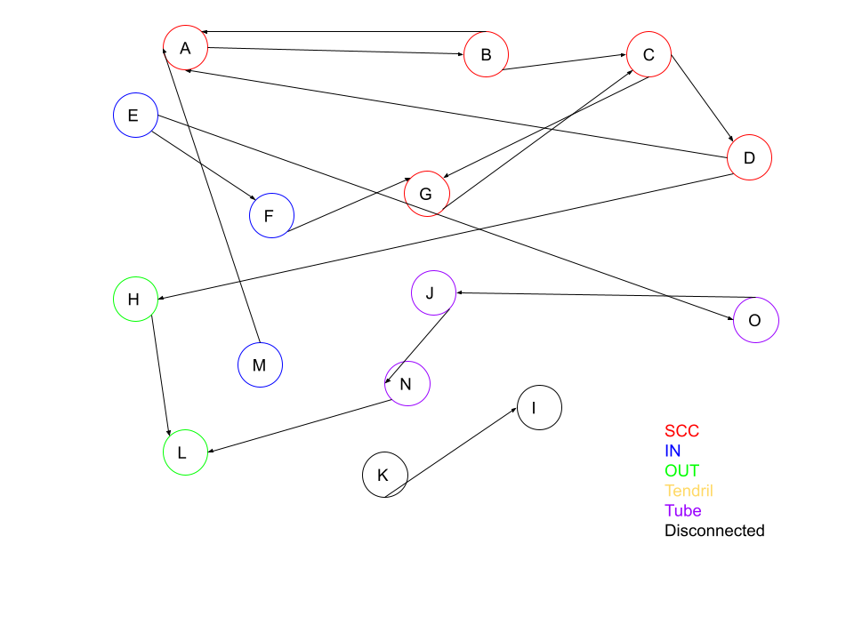

# HW1 - Web Science Intro

### Devin Morgan

### CS 432, Spring 2025

### 02/02/2025

# Q1

Now consider the following links:

```text
A --> B
B --> A
B --> C
C --> D
C --> G
D --> A
D --> H
E --> F
E --> O
F --> G
G --> C
H --> L
J --> N
K --> I
M --> A
N --> L
O --> J
```

Draw the resulting directed graph and list the nodes (in alphabetical order) that are each category.

## Answer



- SCC:
  - A
  - B
  - C
  - D
  - G
- IN:
  - E
  - F
  - M
- OUT:
  - H
  - L
- Tendrils: None
- Tubes: These are tubes because the connect the in node 'E' to the out node 'L' without touching any SCC nodes.
  - J
  - N
  - O
- Disconnected:
  - K
  - I

# Q2

## Answer


a) After opening the webpage this was the screen I was given.


b) I used the following command to complete this section:

```bash
curl.exe -i -L -A "CS432/532" https://www.cs.odu.edu/~mweigle/courses/cs532/ua_echo.php
```

- curl.exe: This specifies the execution of curl on Windows. The .exe extension is necessary to run the program on a Windows machine.
- -i: The -i option instructs curl to include the HTTP response headers in the output. This way, I can see the server’s response headers along with the body of the page.
- -L: The -L option tells curl to follow any redirects automatically. If the server sends a redirect (HTTP 3xx), curl will follow it and show the final destination content. This is useful if the requested URI redirects to a different location.
- -A "CS432/532": The -A option allows me to set a custom User-Agent string. In this case, I replaced the default browser User-Agent with "CS432/532", which simulates a request coming from a specific application or class (as requested by the task).
- https://www.cs.odu.edu/~mweigle/courses/cs532/ua_echo.php: This is the URI I’m requesting. It’s a PHP page that echoes back the User-Agent header sent in the HTTP request.


c) I used the following command to complete this section:

```bash
curl.exe -L -A "CS432/532" -o output.html https://www.cs.odu.edu/~mweigle/courses/cs532/ua_echo.php
```

- curl.exe: This specifies the execution of curl on Windows, just like in the previous command.
- -L: The -L option is used to ensure that curl will follow any redirects if the server responds with a redirect (HTTP 3xx). This option ensures I receive the content even if it has been moved or redirected.
- -A "CS432/532": This sets the User-Agent header to "CS432/532". This matches the custom header requested in the task and makes it clear that the request is coming from a specific context (likely an application or assignment).
- -o output.html: The -o option allows me to specify an output file. In this case, the content of the page will be saved to a file named output.html instead of being printed to the terminal. This is useful for saving the content for later inspection or further processing.
- https://www.cs.odu.edu/~mweigle/courses/cs532/ua_echo.php: This is the URI that I’m requesting, the same PHP page that echoes the User-Agent back to the client.


d) After opening the downloaded output this was the screen I was given.

# Q3

## Answer

To collect the required 500 unique URIs of webpages containing more than 1000 bytes, I developed a Python script that follows these steps:

1. Seed URL: The collection process begins with a given seed URL, provided as a command-line argument to the script. This URL serves as the starting point for gathering further links.
2. Extract Links: The program uses the requests library to fetch the HTML content of the seed page and the BeautifulSoup library to parse the HTML. It extracts all the links on the page.
3. Filter Links: For each extracted link, the script makes a GET request to the link's URL and inspects the HTTP response headers: - The Content-Type header is checked to determine if the link refers to an HTML page (text/html). - The Content-Length header is checked to ensure the page contains more than 1000 bytes of content.
   Only links that meet both of these conditions are considered valid and added to the collection of URIs.
4. Avoid Duplicate Links: A set is used to store the URIs, ensuring that only unique URLs are collected.
5. Recursive Collection: The script then adds these valid links to a queue of pages to process. It randomly selects URLs from this queue and repeats the process of extracting and filtering links from those pages. This continues until the program has collected the specified number (500) of unique URIs.
6. Rate Limiting: To avoid overwhelming the target servers, a 1-second delay (time.sleep(1)) is introduced between requests.
7. Saving the Results: Once the desired number of URIs (500) is collected, they are saved to a text file, collected_uris.txt, for later use in assignments.
